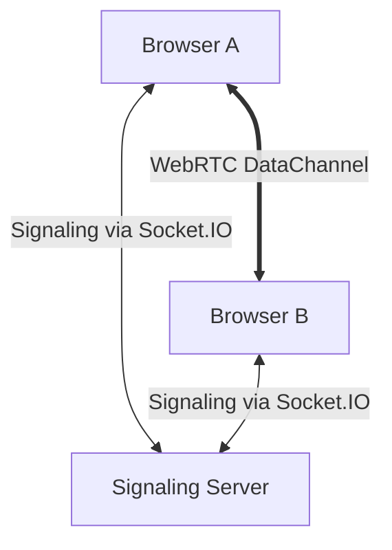

# 🚀 FlashSend - P2P File Transfer

FlashSend is a high-performance, browser-to-browser file transfer application. It uses **WebRTC Data Channels** to send files directly between peers, ensuring privacy and speed. A lightweight **Socket.IO** server is used only for the initial handshake (signaling).

## ✨ Features

- **Direct P2P**: Files never touch the server.
- **Chunked Transfer**: Efficiently handles large files by splitting them into 16KB chunks.
- **Premium UI**: Modern dark theme with real-time progress indicators.
- **No Account Required**: Simply create a room, share the 6-digit code, and start sending.
- **Cross-Network Support**: Works locally or over the internet via STUN/ICE and tunnels.

## 🏗️ Architecture



- **Frontend**: React + TypeScript + Vite
- **Backend**: Node.js + Socket.IO

## 🚀 Getting Started

### 1. Prerequisites
- Node.js (v18+)
- npm

### 2. Installation
Clone the repository and install dependencies:

```bash
# Frontend
cd frontend
npm install

# Server
cd ../server
npm install
```

### 3. Running Locally
Start the signaling server:
```bash
cd server
node index.js
```

Start the frontend:
```bash
cd frontend
npm run dev
```

### 4. Remote Access (Cloudflare Tunnel)
To share the signaling server over the internet:
```bash
cloudflared tunnel --url http://localhost:3001
```
Then update the socket URL in `frontend/src/webrtc.ts`.

## 🛡️ Security
- **Privacy**: Since files are sent Peer-to-Peer, the server operator cannot see or store your files.
- **Future Phase**: End-to-end encryption (E2EE) is planned for the data channel.

## 📄 License
This project is licensed under the MIT License - see the [LICENSE](LICENSE) file for details.
